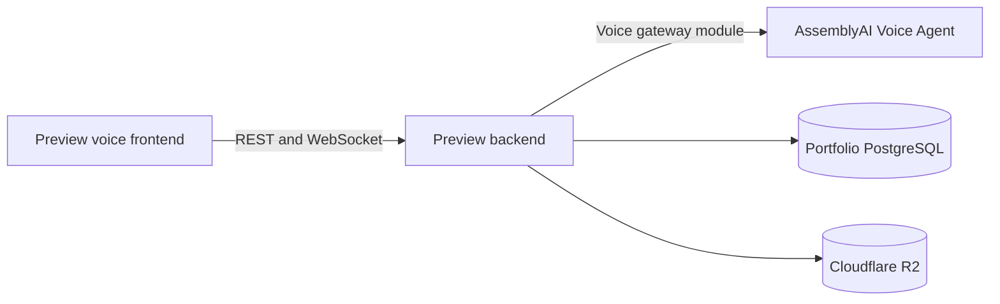

# Mikesplore

## What's Inside?

The main portfolio is available at **[mikesplore.me](https://mikesplore.me)**. This branch contains
the standalone AssemblyAI voice representative and is deployed as a preview service at
`mikesplore.onrender.com`.

* **Voice-first interface:** Milo is the complete frontend entry point; there is no dashboard or secondary voice route in this branch.
* **Verified public browsing:** Ask about projects, profile information, links, certificates, CV resources, skills, and education.
* **Owner mode:** PIN-gated actions can update the profile, CV, projects, certificates, links, skills, and education, with confirmation before writes.
* **Live speech:** AssemblyAI handles realtime speech recognition and agent responses; the browser plays the returned PCM audio.

---

## Tech Stack Overview

Built with **React**, **FastAPI**, **PostgreSQL**, **AssemblyAI Voice Agent API**, and **Cloudflare R2**.

## Architecture

This branch exposes the voice gateway through the same preview backend origin:



The backend exposes both the REST API and `/ws/voice` on one origin. The AssemblyAI gateway module
does not access the database directly; it forwards verified tool requests to the REST API in the
same backend process. If `BACKEND_URL` is omitted, it calls `http://127.0.0.1:$PORT` automatically
(port 8000 locally). The backend remains responsible for persistence, media, and owner-session
authorization. Public questions are read-only. Profile, CV, project, certificate,
link, skill, and education changes require the owner PIN and an explicit browser confirmation.

For local frontend testing against the live portfolio API, set `VITE_API_BASE_URL` to the public
backend origin, for example `https://portfolio.mikesplore.me`. `BACKEND_URL` is optional for the
combined service and should usually be left empty.
`DATABASE_URL` is only required by the main backend service and must be a PostgreSQL connection
string; it is not an HTTP domain.

### Judge test script

Open the deployed voice frontend, allow microphone access, and try these phrases:

1. **“Show me Mike’s projects.”** — Milo should speak a verified answer and display project cards.
2. **“Show me Mike’s profile picture.”** — Milo should display the matching verified media card.
3. **“What skills does Mike have?”** — Milo should answer from the portfolio data.
4. **“Show me Mike’s CV.”** — Milo should request or display the verified CV resource.
5. **“Update Mike’s profile name.”** — Milo should request owner verification before showing the edit flow.

The first four are public read actions. The final phrase demonstrates the protected owner flow;
the PIN should never be included in screenshots, recordings, or repository files.

---

## Local Setup

```bash
# Set up dependencies from the repository root
pip install -r requirements.txt

# Main portfolio backend (database/API service)
alembic -c backend/alembic.ini upgrade head
uvicorn backend.app.main:app --host 0.0.0.0 --port 8000 --reload

# In a second terminal: frontend
cd frontend
npm install
npm run dev
```

The frontend opens Milo directly at `/`.

### Deployment

Deploy the current branch as one Render web service:

Main portfolio backend:

```text
Pre-deploy: alembic -c backend/alembic.ini upgrade head
Start:      uvicorn backend.app.main:app --host 0.0.0.0 --port $PORT
```

Set the preview frontend's single `VITE_API_BASE_URL` to `https://mikesplore.onrender.com`.
The voice WebSocket uses `wss://` automatically on HTTPS deployments. Keep `OWNER_PIN`, service
keys, storage credentials, and `ASSEMBLYAI_API_KEY` in the Render service's secret environment.
